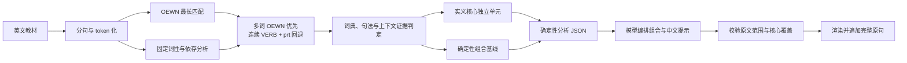

# 教材渐进学习单元工具与架构

本文记录 `lexical-chunks` skill 的接口、核心分析、模型编排和校验边界。学习目标遵循 [ADR 0001](adr/0001-textbook-expression-reproduction.md)，英文编排基线遵循 [ADR 0002](adr/0002-deterministic-progressive-learning-units.md)。

## 当前设计

英文核心由脚本生成，组合由大模型根据语境编排，最终结果仍由脚本校验：

1. 分句并保留每个英文 token 的原文字符范围，使用固定句法模型取得上下文词性、依存角色和字符位置。
2. 使用固定 OEWN 与 Morphy 收集单词和多词表达，保留 lemma、词典词性及表层或 Morphy 匹配方式，再选择最长且互不重叠的匹配。
3. 多词 OEWN 优先；词典未覆盖时，将固定句法模型标为连续 `VERB + prt` 的结构识别为不可拆的动词小品词核心；随后才采用单词 OEWN 和普通 token。
4. 通用规则先排除功能角色，再结合 OEWN 或句法回退证据判断实义，未被 OEWN 覆盖的其他实义词由上下文词性补充。
5. 每个实义核心先独立成为学习单元，并作为模型计划中的必保留单元。
6. 脚本生成确定性组合基线和原子依存证据，供大模型识别名词短语、句式构式和语境绑定结构。
7. 大模型输出连续原文字符范围、构式类别和中文提示；例如将 `light on` 扩展为 `Sleeping with a light on`，而不是输出 `light on could be bad`。
8. 渲染器校验范围、核心覆盖、组合顺序和提示对齐后，追加完整原句。

规则位于 `rules/progression-rules.json`。人工校正面向规则和回归样本，不逐句修改分析结果。

## Birdsong 示例

原句：

```text
Birdsong is good for our mental health.
```

最长 OEWN 与词性分析得到三个实义核心：

```text
Birdsong | good | mental health
```

它们全部独立出题。随后右向折叠最右侧两个核心，原文区间自动带入 `for our`：

```text
good + mental health
→ good for our mental health
```

覆盖全部核心的最后一次合并由完整原句承担，因此 `is` 在最终步骤进入。最终顺序为：

```text
Birdsong
good
mental health
good for our mental health
Birdsong is good for our mental health.
```

## 外部接口

CLI 支持三种工作模式：

- `--analysis-output <路径>`：从标准输入读取英文，输出 schema 6 分析 JSON。
- `--render-analysis <路径>`：读取严格对齐的中文提示 JSON，按 `--format` 生成最终输出。
- `--render-model-plan <路径>`：读取 schema 6 分析 JSON 和模型编排 JSON，按 `--format` 生成最终输出。
- 必须指定上述三种模式之一；不再支持无参数生成兼容 Markdown。

最终输出格式由 `--format` 选择：

- `--format markdown`：生成调试和人工查看用的 Markdown（默认）。
- `--format phraseweave`：生成 PhraseWeave 最小导入备份 JSON。
- `--format both`：同时生成 Markdown 和 PhraseWeave JSON。

`--output <路径>` 是 Markdown 输出路径；在 `phraseweave` 模式下，它作为 JSON
输出路径使用。`--phraseweave-output <路径>` 可在 `both` 模式下单独指定 JSON
路径。未指定时，JSON 路径由 Markdown 路径派生，例如
`text.learning-units.md` 对应 `text.learning-units.json`。

默认路径为 `outputs/lexical-chunks/text.learning-units.md`。同名文件存在时生成 `text-2.learning-units.md` 等递增名称。任何校验失败都返回非零状态且不创建报告。

Markdown 报告只使用分析渲染格式，表格固定包含匹配标签列；每个学习单元只对应一个标签：

```text
| 步骤 | 中文提示 | 英文答案 | 匹配标签 |
|---:|---|---|---|
| 1 | 鸟鸣 | Birdsong | 核心·词典匹配 |
| 2 | 心理健康 | mental health | 核心·词典匹配 |
| 3 | 对我们的心理健康有益 | good for our mental health | 组合·渐进组合 |
| 4 | 鸟鸣有益于我们的心理健康。 | Birdsong is good for our mental health. | 完成·完整原句 |
```

核心标签由分析 JSON 的 `atoms` 生成；混合模式的组合标签由模型计划中的 `kind` 和构式范围确定，但标签集合和范围校验仍由脚本控制。

PhraseWeave JSON 使用现有导入器支持的 schema 1。每个学习单元生成一个
`statement`，每句的完整原句作为最后一个 statement；`soundmark` 暂无音标数据，
固定为空字符串：

```json
{
  "schema_version": 1,
  "statements": [
    {
      "chinese": "鸟鸣",
      "english": "Birdsong",
      "soundmark": ""
    }
  ]
}
```

### 分析 JSON

```json
{
  "schema_version": 6,
  "sentences": [
    {
      "sentence": "Birdsong is good for our mental health.",
      "atoms": [
        {
          "text": "good",
          "start": 12,
          "end": 16,
          "source": "oewn",
          "lexicon_lemmas": ["good"],
          "lexicon_pos": ["a"],
          "match_kind": "surface",
          "head_pos": "ADJ",
          "head_dep": "ROOT",
          "head_atom": null,
          "core": true
        }
      ],
      "learning_units": [
        {
          "text": "good",
          "start": 12,
          "end": 16,
          "kind": "core",
          "core_count": 1
        }
      ]
    }
  ]
}
```

`atoms` 保存可审计的证据来源、OEWN lemma、词典词性、匹配方式、上下文中心词性、依存角色、依存中心原子和实义判断。`head_atom` 是直接句法中心所在原子的零基索引，根节点为 `null`。普通 token 的词典数组为空且 `match_kind` 为 `none`；句法回退使用 `source: "syntax"`、`match_kind: "verb_particle"`，词典数组仍为空。`learning_units` 是确定性模式下的最终中间步骤，也是混合模式提供给大模型的基线：

- `kind: core` 表示必须独立出题的实义核心。
- `kind: composition` 表示由多个相邻实义核心组成的连续原文片段。
- `kind: construction` 表示由模型识别、依赖语境框架才能自然理解的连续原文片段，例如 `with a light on`。
- `core_count` 表示该单元包含的实义核心数量。

加载旧版分析文件时，旧渲染器仍根据 `atoms` 重新计算全部学习单元；混合模式使用独立的 model-plan schema，由渲染器校验模型选择的原文范围和组合结构。

model-plan 使用 schema 1：每个句子携带原句、连续字符范围的 `units`、构式类别、中文提示和整句翻译。模型不能直接改写英文，渲染器从分析中的原句范围重新构造英文答案。

### 中文提示 JSON

```json
{
  "schema_version": 6,
  "sentences": [
    {
      "unit_prompts": ["鸟鸣", "有益的", "心理健康", "对我们的心理健康有益"],
      "sentence_translation": "鸟鸣有益于我们的心理健康。"
    }
  ]
}
```

提示 JSON 不携带英文，只按位置提供中文。句子数和每句提示数必须与分析完全一致；根对象和句子对象都拒绝未知字段。

## 确定性规则

### 实义核心

OEWN 同时参与单词和多词表达匹配。候选按“长度降序、位置升序”选择，较长表达覆盖内部单词。例如 `mental health` 被选中后，不再分别输出 `mental` 和 `health`。

词典选择后，脚本在剩余位置查找连续的动词小品词结构：小品词必须以 `prt` 直接依附于紧邻在前的 `VERB`，两者之间只能有空白，且 spaCy token 必须与内部 token 精确对齐。已选中的多词 OEWN 表达优先于句法回退；句法回退优先于两个单词各自的 OEWN 匹配。合并结果作为一个 `core_count: 1` 的不可拆实义核心。普通介词结构、带插入词的结构和分离结构不会合并。

单词还需结合当前句中的词性和依存角色。判定顺序固定为：

1. 中心词若属于配置的功能词性或功能依存角色，不作为核心。`is` 即使命中 OEWN 的 `be`，在句中仍因 `AUX` 被排除；名词义的 `A` 也会因 `DET/det` 被排除。
2. 多词 OEWN 表达直接作为核心。
3. 单词的 OEWN 词性若与上下文词性兼容，作为核心。
4. OEWN 表层直接命中、且未触发功能排除时，作为核心。这一通用兜底可保留被统计模型误标为 `ADP/advmod` 的 `birdsong`，无需词汇白名单。
5. 未命中 OEWN 的 token 若属于配置的上下文实义词性，作为补充核心。

Morphy 匹配不使用第 4 条兜底，必须得到词典词性与上下文词性的兼容证据。人工维护仅针对通用词性、依存角色、兼容映射和回归样本；OEWN 词条随固定词库版本自动提供。

当前规则文件声明：

```json
{
  "schema_version": 4,
  "content_pos": ["ADJ", "ADV", "NOUN", "NUM", "PROPN", "VERB"],
  "excluded_pos": ["AUX", "CCONJ", "DET", "PART", "PRON", "SCONJ"],
  "excluded_dependencies": [
    "agent",
    "aux",
    "auxpass",
    "case",
    "cc",
    "cop",
    "det",
    "expl",
    "mark",
    "neg",
    "prep",
    "prt"
  ],
  "lexical_pos_compatibility": {
    "a": ["ADJ"],
    "n": ["NOUN", "PROPN"],
    "r": ["ADV"],
    "s": ["ADJ"],
    "v": ["VERB"]
  },
  "combination_strategy": "nominal_phrase_first_right_fold",
  "nominal_head_pos": ["NOUN", "PROPN"],
  "nominal_premodifier_dependencies": [
    "advmod",
    "amod",
    "compound",
    "nummod",
    "npadvmod",
    "quantmod"
  ],
  "verb_particle_head_pos": ["VERB"],
  "verb_particle_dependencies": ["prt"]
}
```

### 渐进组合

所有核心仍先按原文顺序独立输出。确定性脚本继续生成名词短语和右向折叠的基线；混合模式将这些结果连同原句和依存证据交给大模型，由大模型决定最终组合。大模型可以保留、删除或扩展基线，但新增单元必须是连续原文片段并覆盖至少一个核心。

例如：

```text
green spaces
more green spaces
lower speed limits
more green spaces and lower speed limits
needed more green spaces and lower speed limits
```

名词短语形成后可以作为不可拆的组合组。模型还可以识别 `with a light on` 这类依赖语境框架的构式；它不应被截成 `light on`，也不应跨句法边界生成 `light on could be bad`。组合文本始终由脚本从模型返回的原文范围截取，因此限定词、助动词、介词和连词只能随合法组合进入。

若句子有 `N` 个核心：

- 先输出 `N` 个 `core` 单元。
- 再输出名词短语内部组合，并将这些短语折叠成组。
- 最后从右向左合并各组；一次可以增加多个已经组成短语的底层核心。
- 覆盖全部 `N` 个核心的组合由完整原句承担，不额外生成缺少句末标点的重复单元。

`core_count` 始终记录组合实际覆盖的底层实义核心数，因此短语组加入时允许跳增。一个核心仍先独立练习，再进入完整原句。

## 数据流



## 依赖

| 依赖                 | 版本        | 用途                           |
| -------------------- | ----------- | ------------------------------ |
| Wn                   | `1.1.1`     | 读取 WordNet 数据并提供 Morphy |
| Open English WordNet | `oewn:2025` | 单词和多词表达匹配             |
| spaCy                | `3.8.7`     | 固定英语分析 pipeline          |
| en_core_web_sm       | `3.8.0`     | 上下文词性、依存角色和字符位置 |
| Click                | `8.1.8`     | 固定 spaCy 命令依赖的兼容版本  |

相同输入、依赖和规则产生相同实义核心和确定性基线；混合模式的组合由模型计划决定，模型生成的中文措辞也不保证逐字一致。模型计划必须经过脚本校验才能渲染。

## 能力边界

- 当前仅将连续的 `VERB + prt` 识别为不可拆动词小品词核心；其他动词短语和从句仍使用右向折叠，不重建完整依存树。
- 中间答案必须是原句中的连续片段；非连续表达不在当前范围。
- 固定统计模型可能产生稳定但错误的上下文分析；表层 OEWN 证据只能纠正未承担功能角色的部分误标，其余问题通过回归样本调整通用规则。
- 大模型可能选择不自然的组合或返回非法范围；model-plan 校验器会拒绝非法结果，并由 skill 自动触发一次修正或回退。
- 中文提示用于理解和教材表达复现，不表示目标英文是唯一自然表达。
- 英文答案始终来自原句字符范围，中文不能反向修改英文结构。

## 验证

测试覆盖分句、token 化、OEWN lemma/词性/匹配方式、最长非重叠选择、Morphy 词形变体、词典词性兼容、连续动词小品词回退及词典优先级、普通介词和非连续结构排除、表层命中误标兜底、功能角色优先排除、未匹配实义词补充、名词短语优先组合、组合组右向折叠、连接成分吸收、schema 6、model-plan schema 1、`head_atom` 引用与环校验、分析防篡改、核心保留、原文范围和构式标签、中文提示严格对齐、Markdown 转义、失败不创建报告和递增文件名。真实 CLI 验收确认 `Hurry up` 通过句法回退成为单个核心、`Walk up the hill` 不会误合并，并继续覆盖 Birdsong 教材的既有行为。
